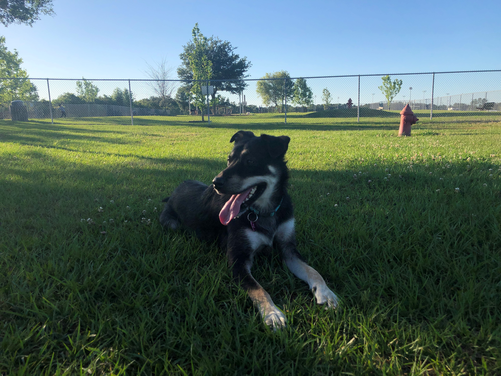

# This is my repository for my work in Dr. Brenton Wiernik's Programming with Data class (progdata-class). I have a folder for each lab assignment, and separate repositories for each of my portfolio pieces. 

# Introduction 
### My name is Cassandra Richardson, but I typically go by Cassie. I will be graduating this semester (May 2022) with my Bachelor's degree in Psychology and a minor in Nutrition. After graduation, I will be taking a gap year to work as a field guide for a Wilderness Therapy company and then I will be applying for doctoral programs in Clinical Psychology. My end goal is to work as a wilderness therapist and develop effective, alternative, and holistic forms of mental health treatment.  

## Fun Facts:
### 1. I work for USF Outdoor Recreation as an Adventure Trip Leader, Challenge Course Facilitator, and Supervisor for the boathouse at Riverfront Park
### 2. I'm currently learning how to DJ
### 3. My favorite hobby is rock climbing

## If you're looking for some new music, here's my SoundCloud with a few playlists. I mostly listen to electronic music.  
### [Cassie's SoundCloud](https://soundcloud.com/ayeeitscass)

## Here's a picture of my dog, because **who doesn't love dogs**? 
# 
